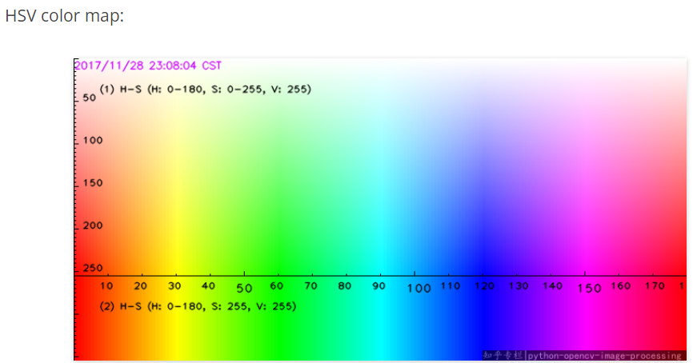
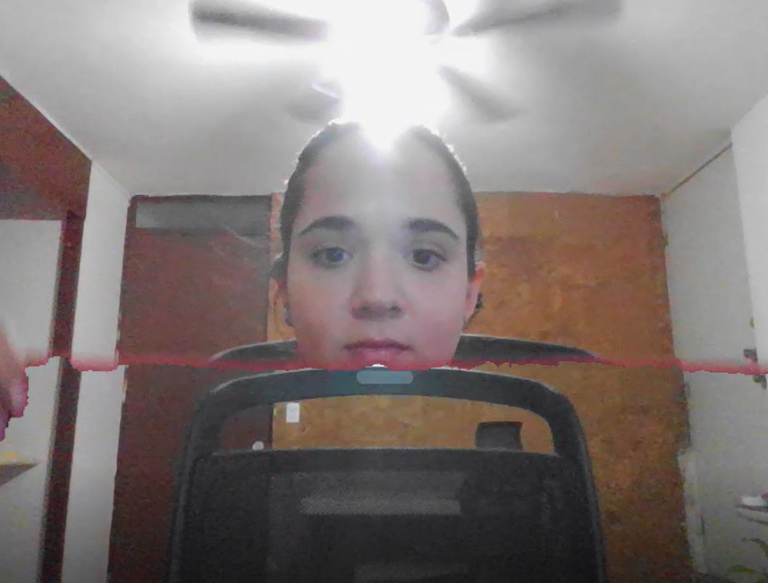

## Reto-1-CV-Challenges

# Harry Potter invisibility cloak.
The objective of this project is to create an invisibility cloak that makes the ilusion of disappearing.

The steps of the project are the following:
  - Capture and store the background.
  - Add trackbars to modify the HSV values according to the color of your cloak.
  - Detect if the color of the cloak is present in the image being captured in the video and segment out the cloak of the frame.
  - Display the final result.
  
## Capture the background.
The reason why the background is captured in a for loop is because even if the background it's a static image, averaging over multiple frames reduces noise in the image.
In the time the background is being captured, it's important that you stay out of sight of the camera, otherwise you will appear in the background image and that ruins the ilusion of disappearing,

## Add trackbars to modify the HSV values according to the color of your cloak.
X axis indicate the Hue values.
Y axis indicate the Saturation values.
It's recommended to set the Value value in a range from 20 to 255.
*Example*
If your cloak is blue, set the H value from 100 - 130 and the V value from 20-255. Try moving the saturation values until you get the range that best fits the saturation of the cloak to make the disappearing more credible. 

## Final result.
Enjoy the experience of this invisibility cloak.

## References.
  - https://www.youtube.com/watch?v=Nv-vehlWnGY&t=433s
  - https://learnopencv.com/invisibility-cloak-using-color-detection-and-segmentation-with-opencv/

Thanks for reading!
_Patty Canales_
